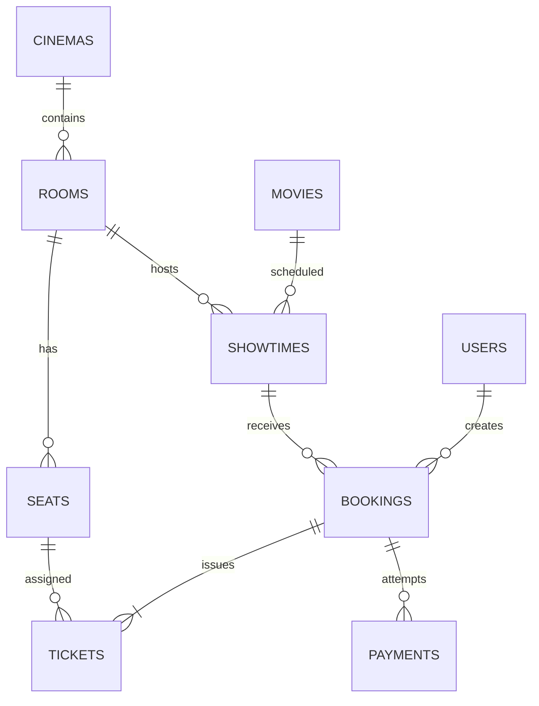

# Kiến trúc hệ thống CineBook

## Phạm vi nghiệp vụ

Hệ thống phục vụ hai nhóm người dùng: khách hàng đặt vé và quản trị viên vận hành rạp. Luồng chính là chọn phim → chọn suất chiếu → chọn ghế → giữ ghế → thanh toán → phát hành vé → check-in.

## Mô hình dữ liệu

## Quy tắc quan trọng

1. Mỗi ghế chỉ có một ticket cho một suất chiếu; ràng buộc unique nằm ở database.
2. Việc tạo booking chạy trong transaction và khóa bản ghi suất chiếu/ghế.
3. Booking chưa trả tiền có thời hạn. Scheduler xóa ticket giữ chỗ và đổi booking sang `expired`.
4. Tổng tiền luôn tính từ `showtimes.base_price + seats.price_surcharge` tại server.
5. Booking chỉ được xác nhận khi callback hợp lệ, đúng số tiền và trạng thái gateway thành công.
6. Callback thanh toán có thể gửi lại nhiều lần nhưng không ghi nhận doanh thu hai lần.

## Trạng thái

| Thực thể | Trạng thái |
|---|---|
| Booking | `pending`, `confirmed`, `cancelled`, `expired` |
| Payment | `initiated`, `pending`, `success`, `failed` |
| Ticket | `valid`, `used`, `cancelled` |
| Showtime | `scheduled`, `cancelled` |

## Tổ chức mã nguồn

- `app/Http/Controllers`: luồng khách hàng, xác thực và thanh toán.
- `app/Http/Controllers/Admin`: nghiệp vụ quản trị.
- `app/Services/BookingService.php`: transaction giữ/hủy/trả ghế.
- `app/Services/PaymentGatewayService.php`: tạo yêu cầu và xác minh chữ ký cổng thanh toán.
- `app/Http/Requests`: validation cho dữ liệu quản trị.
- `database/migrations`: schema và ràng buộc toàn vẹn.
- `tests/Feature`: kiểm thử luồng nghiệp vụ trọng yếu.
