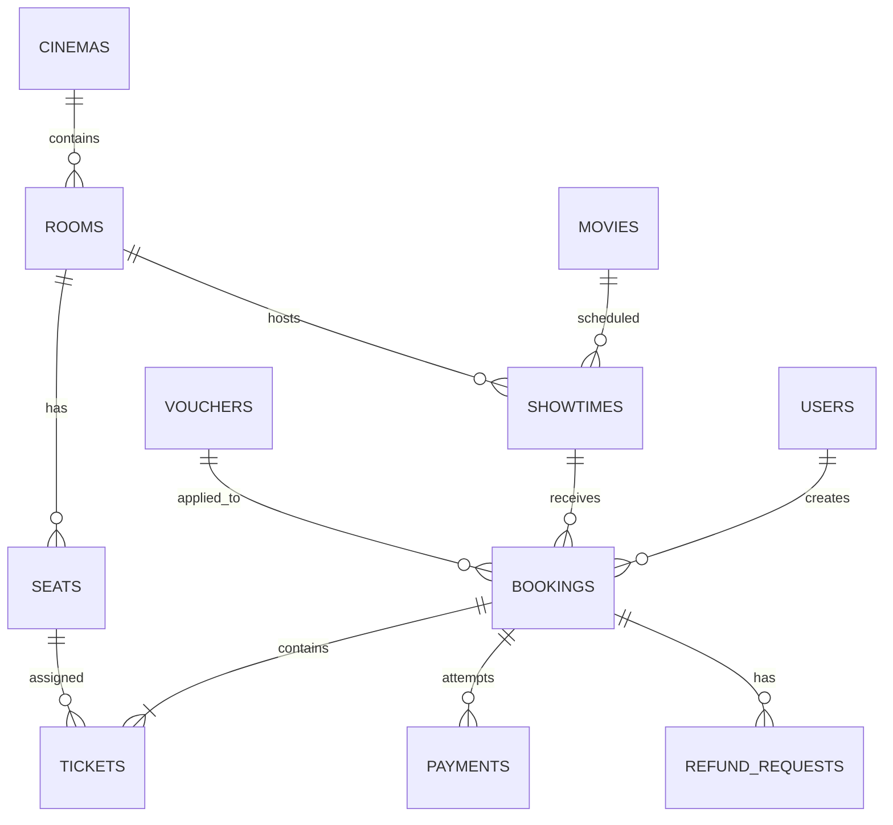

# Kiến trúc hệ thống CinemaStar

## Vai trò và luồng chính

| Vai trò | Phạm vi |
|---|---|
| Khách hàng | Xem lịch, chọn ghế, thanh toán, xem vé, yêu cầu hoàn tiền |
| Nhân viên | Quét QR/mã BK và check-in khách |
| Quản trị viên | Quản lý rạp, nội dung, lịch chiếu, ưu đãi, tài khoản và báo cáo |

Luồng đặt vé: **chọn phim → chọn suất → chọn ghế → giữ ghế → thanh toán → xác nhận email/QR → check-in**.

Nếu khách chọn ghế trước khi đăng nhập, trang chọn ghế lưu lựa chọn ở trình duyệt. Sau khi đăng nhập/đăng ký, Laravel chuyển khách về lại suất chiếu đó.

## Mô hình dữ liệu

## Quy tắc nghiệp vụ

1. Tạo booking chạy trong transaction và khóa dữ liệu suất chiếu/ghế để không bán trùng.
2. Booking chưa thanh toán có thời hạn. Scheduler xóa ticket tạm giữ và trả điểm đã dùng khi hết hạn.
3. Giá do server tính từ giá suất chiếu, loại ghế, voucher và điểm; không nhận giá từ trình duyệt.
4. Ghế VIP E–G phụ thu 30.000₫/ghế. Ghế đôi H được hiển thị theo cặp; một lựa chọn luôn tạo hai ticket vật lý để kiểm soát chỗ ngồi và có giá `2 × (giá cơ bản + 30.000₫) + 30.000₫`.
5. Một ghế đôi không thể bị đặt một nửa: hệ thống tự thêm ghế còn lại của cặp và từ chối khi một trong hai đã được giữ/mua.
6. Mỗi đơn có một mã BK và một QR xác thực ký HMAC. Admin/Staff quét QR đó để check-in toàn bộ ticket hợp lệ trong đơn; quét lại bị từ chối.
7. Callback SePay/MoMo/VNPAY kiểm tra mã đơn, số tiền và chữ ký/khóa xác thực trước khi đổi payment thành công. Xử lý lặp không cộng điểm hoặc gửi email lần hai.
8. Email chỉ được gửi sau khi transaction thanh toán hoàn tất. QR PNG trong email được tạo bằng PHP GD.
9. Voucher được tính trước, sau đó mới đổi điểm. Điểm được cộng đúng một lần sau thanh toán và hoàn lại khi đơn chưa thanh toán bị hủy/hết hạn.
10. Suất chiếu trùng phòng bị chặn; giờ kết thúc gồm thời lượng phim cộng 15 phút chuẩn bị phòng.

## Trạng thái

| Thực thể | Mã lưu trữ | Hiển thị |
|---|---|---|
| Booking | pending, confirmed, cancelled, expired | Chờ thanh toán, Đã thanh toán, Đã hủy, Đã hết hạn |
| Payment | initiated, pending, success, failed | Khởi tạo, Chờ thanh toán, Thành công, Thất bại |
| Ticket | valid, used | Sẵn sàng vào rạp, Đã check-in |
| Showtime | scheduled, cancelled | Đang hoạt động, Đã hủy |

## Tổ chức mã nguồn

- `app/Services/BookingService.php`: transaction giữ ghế, ghế đôi, giá, voucher và ticket.
- `app/Services/PaymentGatewayService.php`: SePay QR, URL thanh toán và xác thực callback.
- `app/Http/Controllers/PaymentController.php`: tạo giao dịch, webhook và gửi email sau thanh toán.
- `app/Http/Controllers/Admin/TicketController.php`: quét QR/mã BK và check-in cả đơn.
- `app/Notifications/PaymentReceiptNotification.php`: email vé và QR PNG.
- `resources/views/showtimes/show.blade.php`: sơ đồ ghế, VIP, ghế đôi và lưu lựa chọn trước đăng nhập.
- `database/migrations`: cấu trúc dữ liệu, cập nhật hàng E–G VIP và hàng H ghế đôi.
